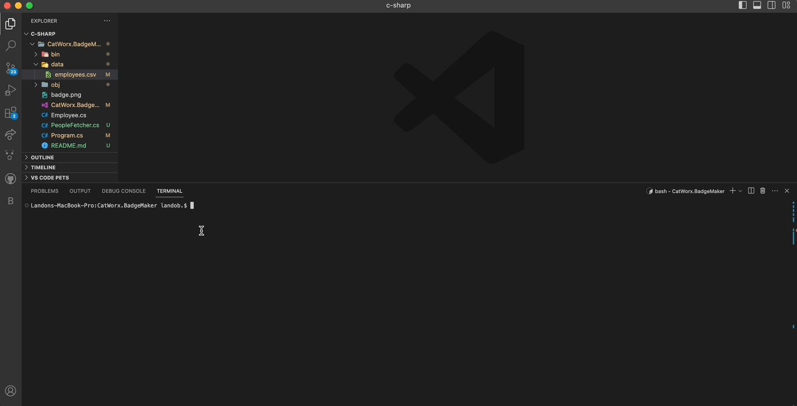
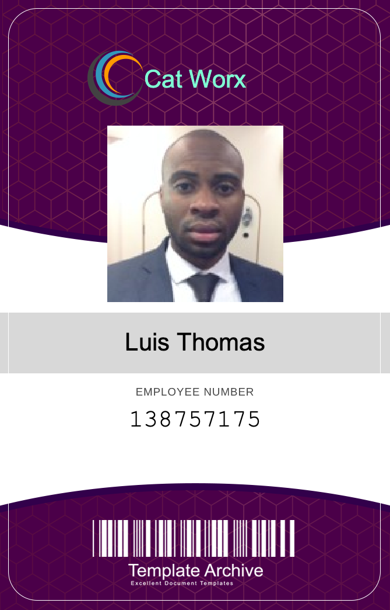

# C# Badge Maker - Cat Worx

## Description

C# Badge Maker is a CLI Application that allows users to generate ID badges pngs that include the employee name, id, and photo. It was built to learn C#.

While building this project I learned to:

- Manipulate the file system to generate files and folders
- Install C# packages using `dotnet`
- Import packages with the `using` tag. Primarily from the `System` and also from `dotnet` packages.
- Run a C# file by using `dotnet run` or `dotnet watch`

### Built With

## Table of Contents

- [Installation](#installation)
- [Usage](#usage)
- [Contributing](#contributing)
- [License](#license)
- [Contact](#contact)

## Installation

1. Fork the repo
2. Clone the code to your local machine
3. Open in `VS Code`

## Usage

From the terminal run `dotnet run` to begin the application.

1. You will be asked if you would like to auto generate ids. If true 10 ids will be generated and placed within the `data` folder. If false continue reading.
2. You will be asked to enter a first name, last name, id, and photo url. For the photo url feel free to use `https://placekitten.com/400/400` .
3. Once you have finished entering one id you may either continue entering ids or simply hit enter with no input to finish. Ids will be generated and placed within the `data` folder.

## Walkthrough - GIF 
The gif below shows the functional app:

## Mockup
The image below is an example output id:

## Contributing

 `Landon Murray`

## License

N/A

## Contact

Landon Murray - [GitHub](https://github.com/LandoBM) - [Email](landon.swdeveloper@gmail.com) - 
